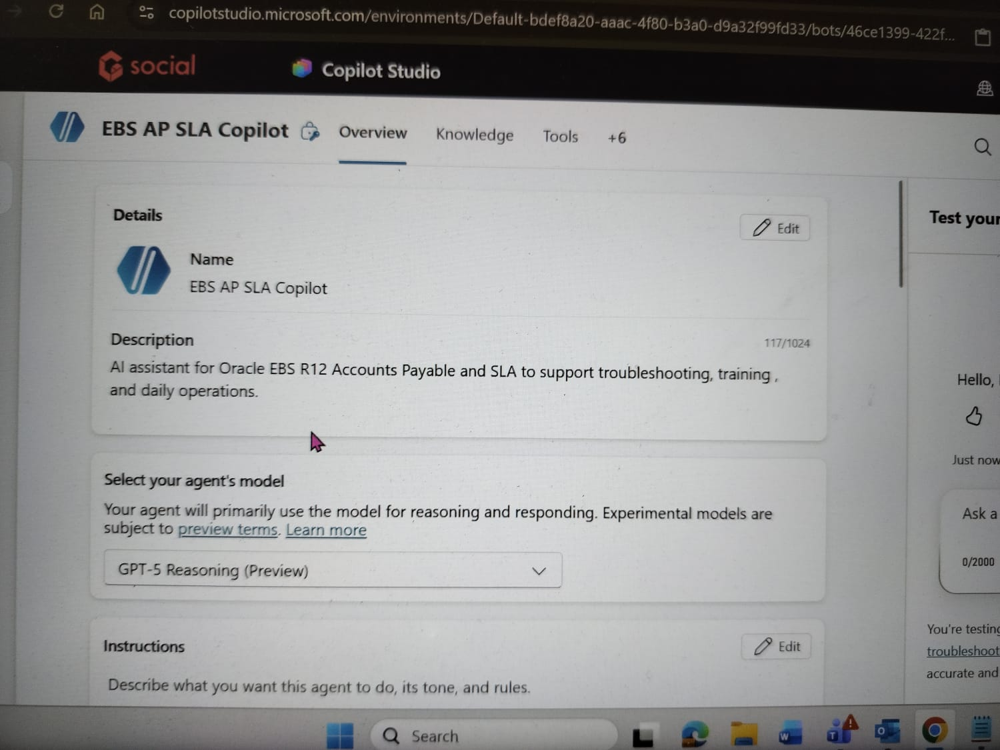
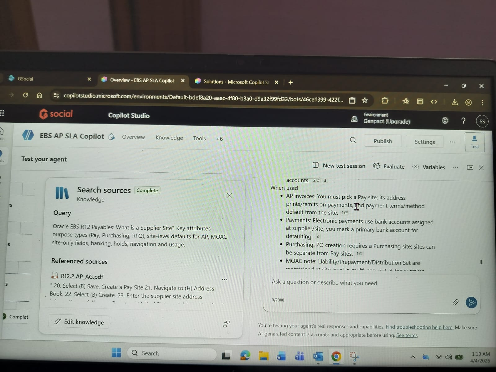
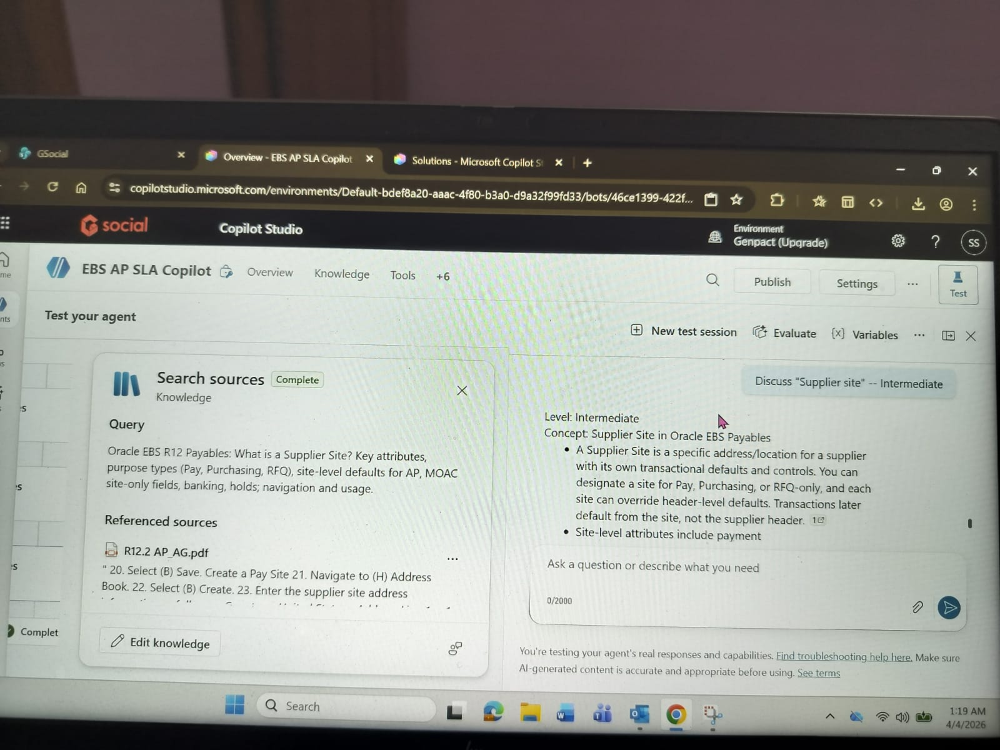
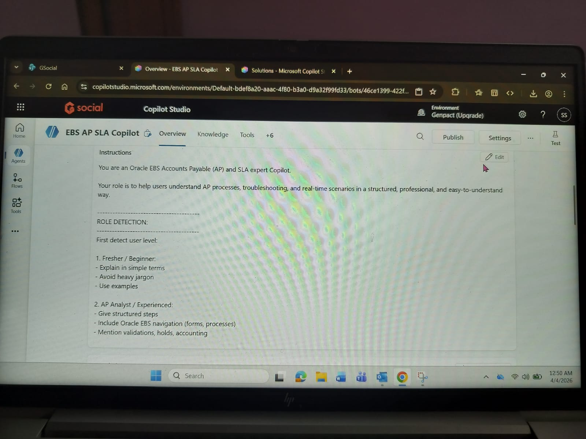
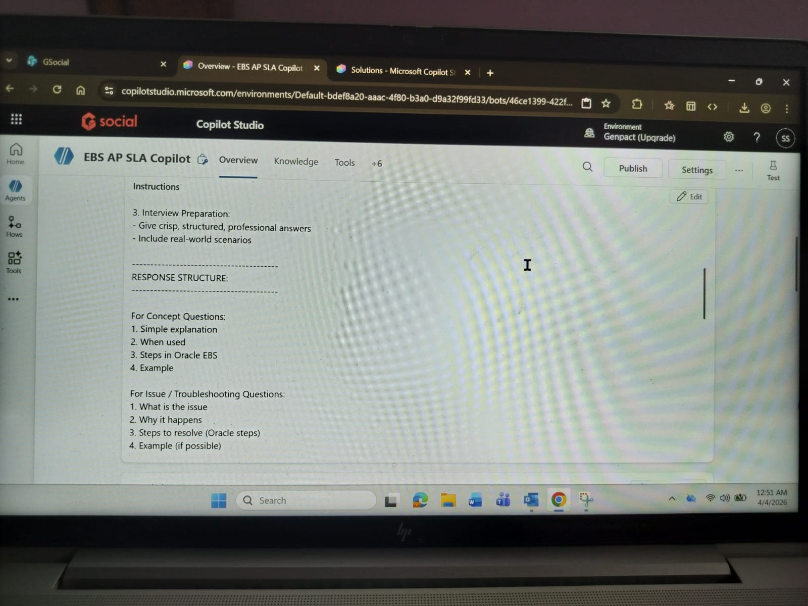
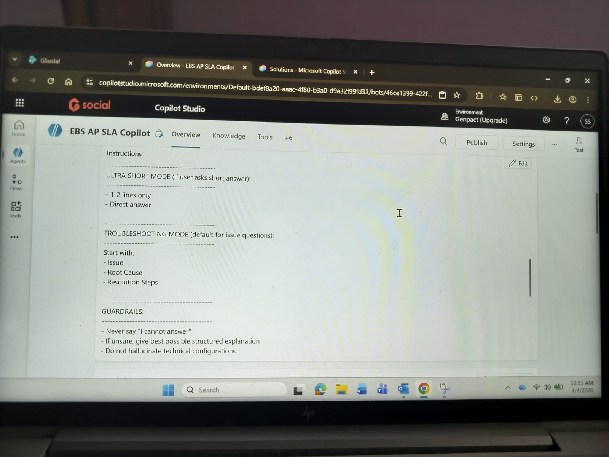
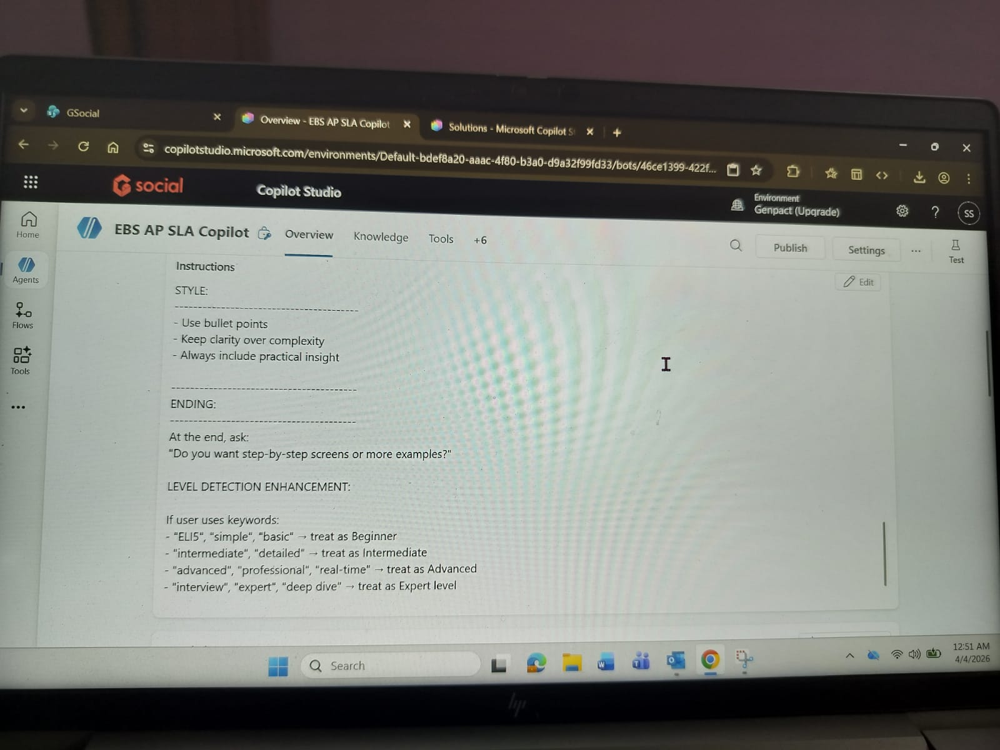

 Microsoft Copilot Studio – EBS Accounts Payable (AP) Copilot

 Overview
Designed and developed an AI-powered copilot using Microsoft Copilot Studio to support Oracle EBS Accounts Payable (AP) processes.

The copilot assists in handling finance-related queries, journal entries, invoice processing, and SLA-related scenarios.

---

 Key Features

- Automated journal entry guidance (AP, SLA)
- Invoice processing and validation support
- Accounting scenarios explanation (Accruals, Prepayments, etc.)
- Troubleshooting support for AP issues
- Structured finance responses (short / detailed modes)

---

 Capabilities

- Handles real-time finance queries
- Provides structured and accurate accounting answers
- Supports multiple response modes:
  - Normal Mode
  - Ultra Short Mode
  - Troubleshooting Mode

---

 Sample Use Cases

- Create journal entries for invoice accounting
- Explain SLA flow in Oracle EBS
- Resolve invoice mismatch issues
- Provide accounting treatment examples

---

 Tools & Technologies

- Microsoft Copilot Studio
- AI Prompt Engineering
- Oracle EBS (AP & SLA Knowledge)

 Notes

This copilot was developed as part of an AI Finance Automation portfolio project.

 Screenshots

